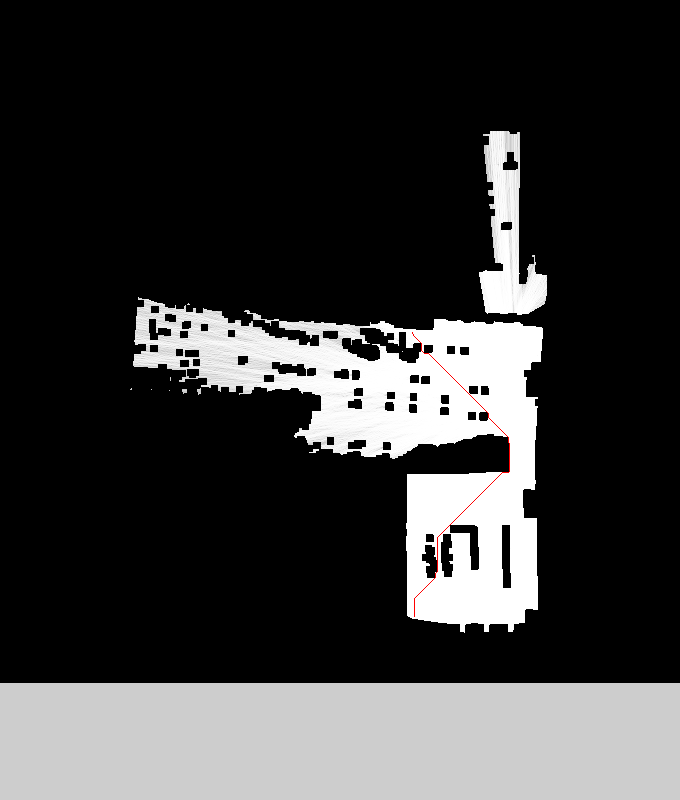

MapPlanner
==========

はじめに
--------

MapPlannerは、マップ画像から2点間の最短経路を計算するC++のデモプログラムである。実質的には、マップを表現するMapPlaneクラス、
最短経路を探索するPathFinderクラスの2つからなる。また、PPM形式の画像の読み書きを実装したPPMクラスがおまけとして付いてくる。

前提とアルゴリズム
------------------

マップは基本的に2次元画像であり、各ピクセルは0～255の値を持つ。白い（値が大きい）ピクセルは移動可能であることを示し、黒い（値が小さい）ピクセ
ルは移動不可能であることを示す。下の画像はマップの例であり、黒いピクセルはLRFで観測した障害物、白いピクセルはLRFで観測した障害物のない領域、灰
色は未観測領域を示す。

\
\
最初にここから移動可能領域を計算する。ピクセルの輝度に関して閾値を与え、閾値より大きい（すなわち、白い）ピクセルを「移動可能」、小さいピクセルを「移動不
可能」と判定する。また、障害物から一定の距離範囲内にはロボットが接近できないので、移動不可能ピクセルから一定の範囲内も実質的な移動不可能領域と判定しなけ
ればならない。そのようにして処理したマップは次のようになる。\
\
\
次に、移動可能領域を2点選んで、その間の最短経路を計算する。経路計算は、すべてのピクセルをグラフのノードとするグラフ最短経路探索を用いている。計算には
A\*アルゴリズムを使っており、ポテンシャルは考慮しないので、基本的に移動可能領域の縁に沿う経路を選択する。ただし、ピクセル間の移動の際は、あるピクセルの
8近傍のどれかに移動する経路を選ぶため、全体として斜めの直線経路を選ぶことができず、縦・横および斜め45度の経路を組み合わせたような経路が選ばれる。\
\
\

クラスの利用方法
----------------

### MapPlaneクラス

マップを表現するクラスである。\

#### メンバ変数（publicなもののみ）

  int width       マップの幅。単位はピクセル。

  int height      マップの高さ。単位はピクセル。

  int threshold   各ピクセルを「移動可能」「移動不可能」に分けたときの閾値。閾値が設定されていない場合には-1になる。マップ作成時には閾値は設定されて おらず、mask\_brigher(), mask\_darker()メソッドを呼んだ時点で閾値が設定される。

#### コンストラクタとファクトリメソッド

  MapPlane(int w, int h)     幅w、高さhのマップを生成する。ピクセルの値は初期化されない。

  MapPlane(MapPlane& map)    既存のマップをコピーして新たなマップを生成する。

  MapPlane(MapPlane\* map)   既存のマップをコピーして新たなマップを生成する。

  MapPlane(PPM& ppm)         PPM形式画像からマップを生成する。カラー画像の場合には、Rプレーンだけからピクセル値を取得する。

#### メソッド

  uint8\_t get(int x, int y)                                  (x,y)のピクセル値を取得する。(x,y)がマップの範囲外であった場合には例外を投げる。

  void set(int x, int y, uint8\_t value)                      (x,y)のピクセル値を value にする。(x,y)がマップの範囲外であった場合には例外を投げる。

  bool is\_bright(int x, int y, uint8\_t value)               (x,y)のピクセル値がvalue より明るいかどうかを判定する。明るい場合はtrueを返す。

  bool is\_bright(int x, int y)                               (x,y)のピクセル値が設定してある閾値（メンバ変数threshold）より明るいか どうかを判定する。明るい場合はtrueを返す。

  MapPlane\* mask\_brighter(int length, uint8\_t threshold)   元のマップに対して、明るい点の周辺length×lengthの正方形領域を「明るい」点に設定した新たなマップを返す。ここで指定した閾値が、新たなマップの変数thresholdに設定される。

  MapPlane\* mask\_darker(int length, uint8\_t threshold)     元のマップに対して、暗い点の周辺length×lengthの正方形領域を「暗い」点に設定した新たなマップを返す。ここで指定した閾値が、新たなマップの変数thresholdに設定される。

  PPM\* toPPM()                                               マップをPPM形式画像に変換し、その画像を返す。

### PathFinderクラス

マップの経路探索をするためのクラスである。必要なマップを生成した後、PathFinderのインスタンスを生成して、find()メソッドを呼ぶことで経路が探索される。

#### コンストラクタとファクトリメソッド

  PathFinder(MapPlane\* map)   マップからPathFinderインスタンスを生成する。

#### メソッド

  std::vector&lt;PathFinder::Position&gt;&amp; find(int x1, int y1, int x2, int y2)   (x1, y1)から(x2, y2)への最短経路を計算する。計算された最短経路は、PathFinder::Position型のvectorとして帰ってくる。 PathFinder::Position型 は、xとyの2つのメンバ変数を持つ単純な構造体である。始点または終点の座標が移動可能（明るいピクセル）でなかった場合には例外を投げる。また、始点と終点がそれぞれ属する領域が連結でない（経路がない）場合にも例外を投げる。

std::vector&lt;PathFinder::Position&gt;&amp; makeLines(std::vector&lt;PathFinder::Position&gt;&amp; path)  find()が返す経路は１ピクセルごとの座標列であるが、makeLines()はその座標列を引数とし、できるだけ数の少ない直線列にまとめたうえ、直線の端点列を返す。 
### PPMクラス

PPM (Portable
Pixmap)形式の非圧縮画像を扱うクラス。PPM形式と類似した画像形式の解説及びツールについては、[Netpbm
のページ](http://netpbm.sourceforge.net/)を参照のこと。PPM形式を扱うことのできるツールとしては、Netpbmのツールのほか、[ImageMagick](https://www.imagemagick.org/script/index.php)で
も対応している。

#### メンバ変数

  static const PPM::pixel BLACK, RED, GREEN, YELLOW, BLUE, MAGENTA, CYAN, WHITE   それぞれの色のピクセルを表現する定数。

#### コンストラクタとファクトリメソッド

  PPM(int width, int height)            幅と高さを指定してPPM画像を生成する。

  PPM(PPM& ppm)                         他のPPM画像からPPM画像を生成する。

  PPM\* create(const char \*filename)   ファイルからPPM画像を読み込む。ファイルが存在しない場合、ファイル形式が異常な場合な どの場合は例外を投げる。

#### メソッド

  int Width()                         画像の幅をピクセル単位で返す。

  int Height()                        画像の高さをピクセル単位で返す。

  pixel& point(int x, int y)          (x,y)のピクセルへの参照を返す。

  void write(const char \*filename)   ファイルにPPM画像を書きだす。

  void drawLine(int x1, int y1, int x2, int y2, pixel pix)     (x1,y1)から(x2,y2)までの直線上のピクセル値をpixにセットする。

### PPM::pixelクラス

ピクセルを表現するクラス。

#### メンバ変数

  uint8\_t pix\[3\]   R, G, B各色の値を保持する。

